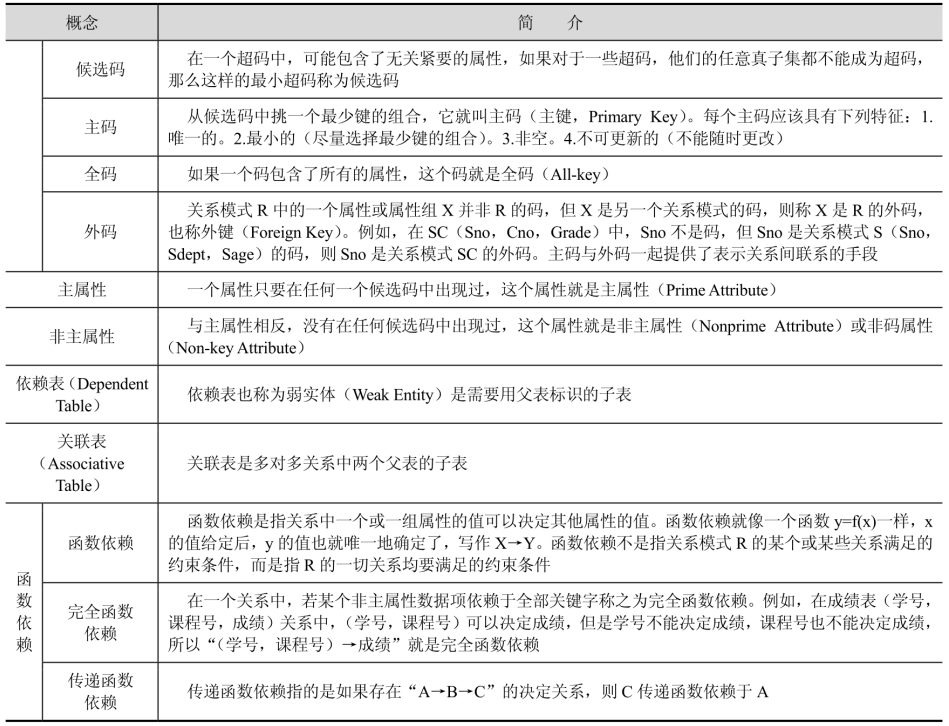

## 什么是范式和反范式？

当设计关系型数据库时，需要遵从不同的规范要求，设计出合理的关系型数据库，这些不同的规范要求被称为不同的范式（Normal Form），越高的范式数据库冗余越小。应用数据库范式可以带来许多好处，但是最主要的目的是为了消除重复数据，减少数据冗余，更好地组织数据库内的数据，让磁盘空间得到更有效的利用。范式的缺点：范式使查询变得相当复杂，在查询时需要更多的连接，一些复合索引的列由于范式化的需要被分割到不同的表中，导致索引策略不佳。

### 什么是第一、二、三、BC 范式？

所谓“第几范式”，是表示关系的某一种级别，所以经常称某一关系 R 为第几范式。目前关系型数据库有六种范式：第一范式（1NF）、第二范式（2NF）、第三范式（3NF）、巴斯-科德范式（BCNF）、第四范式（4NF）和第五范式（5NF，又称完美范式）。满足最低要求的范式是第一范式（1NF）。在第一范式的基础上进一步满足更多规范要求的称为第二范式（2NF），其余范式以此类推。一般说来，**数据库只需满足第三范式（3NF）就行了**。满足高等级的范式的先决条件是必须先满足低等级范式。

在关系数据库中，关系是通过表来表示的。在一个表中，每一行代表一个联系，而一个关系就是由许多的联系组成的集合。所以，在关系模型中，关系用来指代表，而元组用来指代行，属性就是表中的列。对于每一个属性，都存在一个允许取值的集合，称为该属性的域。

### 范式常用概念




#### 实体（Entity）

就是实际应用中要用数据描述的事物，它是**现实世界中客观存在并可以被区别的事物**，一般是名词。比如“一个学生”、“一本书”、“一门课”等等。需要注意的是，这里所说的“事物”不仅仅是看得见摸得着的“东西”，它也可以是虚拟的，比如说“老师与学校的关系”。

#### 数据项（Data Item）

即**字段（Fields）**也可称为**域**、**属性**、**列**。**数据项是数据的不可分割的最小单位**。数据项可以是字母、数字或两者的组合。通过数据类型（逻辑的、数值的、字符的等）及数据长度来描述。数据项用来描述实体的某种属性。数据项包含数据项的名称、编号、别名、简述、数据项的长度、类型、数据项的取值范围等内容。教科书上解释为：“实体所具有的某一特性”，由此可见，属性一开始是个逻辑概念，比如说，“性别”是“人”的一个属性。在关系数据库中，属性又是个物理概念，**属性可以看作是“表的一列”**。

#### 数据元素（Data Element）

数据元素是数据的基本单位。数据元素也称**元素**、**行**、**元组**、**记录（Record）**。一个数据元素可以由若干个数据项组成。表中的一行就是一个元组。

#### 码

也称为**键（Key）**，它是数据库系统中的基本概念。所谓码就是**能唯一标识实体的属性**，它是**整个实体集的性质**，而不是单个实体的性质，包括超码、候选码、主码和全码。

- **超码**：**超码是一个或多个属性的集合**，这些属性的组合**可以在一个实体集中唯一地标识一个实体**。如果 K 是一个超码，那么 K 的任意超集也是超码，也就是说如果 K 是超码，那么所有包含 K 的集合也是超码。
- **候选码**：在一个超码中，可能包含了无关紧要的属性，如果对于一些超码，他们的任意真子集都不能成为超码，那么这样的最小超码称为候选码。
- **主码**：**候选码中最少键的组合**，它就叫**主码（主键，Primary Key）**。每个主码应该具有下列特征：
  - 唯一
  - 最小，尽量选择**最少键**的组合
  - 非空
  - **不可更新**，不能随时更改
- **全码**：如果一个码包含了所有的属性，这个码就是全码（All-key）。
- **外码**：关系模式 R 中的一个属性或属性组 X 并非 R 的码，但 X 是另一个关系模式的码，则称 X 是 R 的外码，也称**外键（Foreign Key）**。主码与外码一起提供了**表示关系间联系**的手段。

#### 主属性

一个属性只要**在任何一个候选码中出现过**，这个属性就是主属性（Prime Attribute）。

#### 非主属性

与主属性相反，**没有在任何候选码中出现过**，这个属性就是**非主属性**（Nonprime Attribute）或**非码属性**（Non-key Attribute）。

#### 依赖表（Dependent Table）

也称为弱实体（Weak Entity）是需要**用父表标识的子表**。

#### 关联表（Associative Table）

是多对多关系中**两个父表的子表**。

#### 依赖

- **函数依赖**：函数依赖是指**关系中一个或一组属性的值可以决定其他属性的值**。函数依赖就像一个函数 `y=f(x)` 一样，**x 的值给定后，y 的值也就唯一地确定了**，写作 `X→Y`。函数依赖不是指关系模式 R 的某个或某些关系满足的约束条件，而是指 **R 的一切关系均要满足的约束条件**。
- **完全函数依赖**：在一个关系中，若**某个非主属性数据项依赖于全部关键字称之为完全函数依赖**。例如，在成绩表（学号，课程号，成绩）关系中，（学号，课程号）可以决定成绩，但是学号不能决定成绩，课程号也不能决定成绩，所以“（学号，课程号）→成绩”就是完全函数依赖。
- **传递函数依赖**：指的是如果存在 “A→B→C” 的决定关系，则 C 传递函数依赖于 A。

### 范式特征详解表格


### 第一范式（1NF）：属性不可分

所谓第一范式（1NF）是指在关系模型中，对域添加的一个规范要求，**所有的域都应该是原子性的**，即**数据库表的每一列都是不可分割的原子数据项**，而不能是集合、数组、记录等非原子数据项。即当实体中的某个属性有多个值时，必须将其拆分为不同的属性。在符合第一范式（1NF）表中的每个域值只能是实体的一个属性或一个属性的一部分。简而言之，第一范式就是无重复的域。例如，由“职工号”、“姓名”、“电话号码”组成的职工表，由于一个人可能有一个办公电话和一个移动电话，所以，这时可以将其规范化为1NF。将电话号码分为“办公电话”和“移动电话”两个属性，即职工表（职工号，姓名，办公电话，移动电话）。

需要注意的是，在任何一个关系型数据库中，**第一范式（1NF）是对关系模式的设计基本要求**，一般设计时都必须满足第一范式（1NF）。不过有些关系模型中突破了1NF的限制，这种称为非1NF的关系模型。换句话说，是否必须满足1NF的最低要求，主要依赖于所使用的关系模型。不满足1NF的数据库就不是关系数据库。**满足1NF的表必须要有主键且每个属性不可再分**。

### 第二范式（2NF）：非主属性完全依赖于码

在1NF的基础上，**每一个非主属性必须完全依赖于码**（在1NF基础上，**消除非主属性对主键的部分函数依赖**）。

第二范式（2NF）是在第一范式（1NF）的基础上建立起来的，即满足第二范式（2NF）必须先满足第一范式（1NF）。第二范式（2NF）要求数据库表中的**每个实例或记录必须可以被唯一地区分**。选取一个能区分每个实体的属性或属性组，作为实体的唯一标识。

例如，在选课关系表（学号，课程号，成绩，学分）中，码为组合关键字（学号，课程号）。但是，由于**非主属性学分仅仅依赖于课程号**，对关键字（学号，课程号）只是部分依赖，而不是完全依赖，所以，此种方式会导致数据冗余、更新异常、插入异常和删除异常等问题，其设计不符合2NF。解决办法是将其分为两个关系模式：学生表（学号，课程号，分数）和课程表（课程号，学分），新关系通过学生表中的外键字课程号联系，在需要时通过两个表的连接来取出数据。

第二范式（2NF）要求**实体的属性完全依赖于主关键字**。所谓完全依赖是指**不能存在仅依赖主关键字一部分的属性**，如果存在，那么这个属性和主关键字的这一部分应该分离出来形成一个新的实体，新实体与原实体之间是一对多的关系。为实现区分通常需要为表加上一个列，以存储各个实例的唯一标识。简而言之，第二范式就是在第一范式的基础上属性完全依赖于主键。

**所有单关键字的数据库表都符合第二范式**，因为不可能存在组合关键字。

### 第三范式（3NF）

在1NF基础上，每个非主属性既不部分依赖于码也不传递依赖于码（**在2NF基础上消除传递依赖**）。如果关系模式R是第二范式，且每个非主属性都不传递依赖于R的码，则称R是第三范式的模式。第三范式（3NF）是第二范式（2NF）的一个子集，即满足第三范式（3NF）前必须先满足第二范式（2NF）。

例如，学生表（学号，姓名，课程号，成绩），其中学生姓名若无重名，所以，该表有两个候选码（学号，课程号）和（姓名，课程号），则存在函数依赖：学号→姓名，（学号，课程号）→成绩，（姓名，课程号）→成绩，唯一的非主属性成绩对码不存在部分依赖，也不存在传递依赖，所以，属于第三范式。

满足第三范式的数据库表应该不存在如下依赖关系：

关键字段 → 非关键字段 x → 非关键字段 y

假定学生关系表为（学号，姓名，年龄，所在学院，学院地点，学院电话），关键字为单一关键字“学号”，因为存在如下决定关系：

（学号）→（姓名，年龄，所在学院，学院地点，学院电话）

这个关系是符合2NF的，但是不符合3NF，因为存在如下决定关系：

（学号）→（所在学院）→（学院地点，学院电话）

即存在非关键字段“学院地点”、“学院电话”对关键字段“学号”的传递函数依赖。它也会存在数据冗余、更新异常、插入异常和删除异常的情况。把学生关系表分为如下两个表：

学生：（学号，姓名，年龄，所在学院）；

学院：（学院，地点，电话）。

这样的数据库表是符合第三范式的，**消除了数据冗余、更新异常、插入异常和删除异常**。

### BCNF（Boyce-Codd Normal Form）

在1NF基础上，**任何非主属性不能对主键子集依赖**（在3NF基础上**消除对主键子集的依赖**）。

若关系模式R是第一范式，且每个属性（包括主属性）既不存在部分函数依赖也不存在传递函数依赖于R的候选键，这种关系模式就是BCNF模式。即在第三范式的基础上，数据库表中如果不存在任何字段对任一候选关键字段的传递函数依赖则符合BCNF。BCNF是修正的第三范式，有时也称扩充的第三范式。

BCNF是第三范式（3NF）的一个子集，即满足BCNF必须满足第三范式（3NF）。通常情况下，BCNF被认为没有新的设计规范加入，只是对第二范式与第三范式中设计规范要求更强，因而被认为是修正第三范式，也就是说，它事实上是对第三范式的修正，使数据库冗余度更小。这也是BCNF不被称为第四范式的原因。

对于BCNF，在主键的任何一个真子集都不能决定于主属性。关系中U主键，若U中的任何一个真子集X都不能决定于主属性Y，则该设计规范属性BCNF。例如：在关系R中，U为主键，A属性是主键中的一个属性，若存在A->Y，Y为主属性，则该关系不属于BCNF。

假设仓库管理关系表（仓库号，存储物品号，管理员号，数量），满足一个管理员只在一个仓库工作；一个仓库可以存储多种物品。则存在如下关系：

（仓库号，存储物品号）→（管理员号，数量）
（管理员号，存储物品号）→（仓库号，数量）

所以，（仓库号，存储物品号）和（管理员号，存储物品号）都是仓库管理关系表的候选码，表中的唯一非关键字段为数量，它是符合第三范式的。但是，由于存在如下决定关系：

（仓库号）→（管理员号）
（管理员号）→（仓库号）

**即存在关键字段决定关键字段的情况**，所以，其不符合BCNF范式。把仓库管理关系表分解为二个关系表：仓库管理表（仓库号，管理员号）和仓库表（仓库号，存储物品号，数量），这样的数据库表是符合BCNF范式的，消除了删除异常、插入异常和更新异常。

## 符合不同范式的数据库设计

学习了范式，为了巩固理解，接下来设计一个论坛的数据库，该数据库中需要存放如下信息：

1. 用户：用户名，EMAIL，主页，电话，联系地址。
2. 帖子：发帖标题，发帖内容，回复标题，回复内容。

### 第一范式

第一次可以将数据库设计为仅仅存在的一张表：

```
用户名 EMAIL 主页 电话 联系地址 发帖标题 发帖内容 回复标题 回复内容
```

这个数据库表符合第一范式，但是没有任何一组候选关键字能决定数据库表的整行，唯一的关键字段用户名也不能完全决定整个元组。

所以，需要增加“发帖ID”、“回复ID”字段，即将表修改为：

用户名 EMAIL 主页 电话 联系地址 发帖ID 发帖标题 发帖内容 回复ID 回复标题 回复内容

这样数据表中的关键字（用户名，发帖ID，回复ID）能决定整行：

（用户名，发帖ID，回复ID）→（EMAIL，主页，电话，联系地址，发帖标题，发帖内容，回复标题，回复内容）

但是，这样的设计不符合第二范式，因为存在如下决定关系：

（用户名）→（EMAIL，主页，电话，联系地址）

（发帖ID）→（发帖标题，发帖内容）

（回复ID）→（回复标题，回复内容）

即非关键字段部分函数依赖于候选关键字段，很明显，这个设计会导致大量的数据冗余和操作异常。

### 第二范式/第三范式

对这张表进行分解，具体可以分解为（带下划线的为关键字）：

1. 用户信息：用户名，EMAIL，主页，电话，联系地址。
2. 帖子信息：发帖ID，标题，内容。
3. 回复信息：回复ID，标题，内容。
4. 发贴：用户名，发帖ID。
5. 回复：发帖ID，回复ID。

这样的设计是满足第一、二、三范式和BCNF范式要求的。但是这样的设计不一定是最好的。

观察可知，第4项“发帖”中的“用户名”和“发帖ID”之间是1∶N的关系，因此，可以把“发帖”合并到第2项的“帖子信息”中；第5项“回复”中的“发帖ID”和“回复ID”之间也是1∶N的关系，因此，可以把“回复”合并到第3项的“回复信息”中。这样可以一定程度地减少数据冗余，新的设计如下所示：

1. 用户信息：用户名，EMAIL，主页，电话，联系地址。
2. 帖子信息：用户名，发帖ID，标题，内容。
3. 回复信息：发帖ID，回复ID，标题，内容。

数据库表1显然满足所有范式的要求。

数据库表2中存在非关键字段“标题”、“内容”对关键字段“发帖ID”的部分函数依赖，满足第二范式的要求，但是这一设计并不会导致数据冗余和操作异常。

数据库表3中也存在非关键字段“标题”、“内容”对关键字段“回复ID”的部分函数依赖，也不满足第二范式的要求，但是与数据库表2相似，这一设计也不会导致数据冗余和操作异常。

由此可以看出，并不一定要强行满足范式的要求，对于1∶N关系，当1的一边合并到N的那边后，N的那边就不再满足第二范式了，但是这种设计反而比较好。

对于M∶N的关系，不能将M一边或N一边合并到另一边去，这样会导致不符合范式要求，同时导致操作异常和数据冗余。

对于1∶1的关系，可以将左边的1或者右边的1合并到另一边去，设计导致不符合范式要求，但是并不会导致操作异常和数据冗余。

所以，满足范式要求的数据库设计是结构清晰的，同时可避免数据冗余和操作异常。这并意味着不符合范式要求的设计一定是错误的，在数据库表中存在1∶1或1∶N关系这种较特殊的情况下，合并导致的不符合范式要求反而是合理的。

所以，在数据库设计的时候，一定要时刻考虑范式的要求。

## 反范式

数据库设计要严格遵守范式，这样设计出来的数据库，虽然思路很清晰，结构也很合理，但是，有时候却要在一定程度上打破范式设计。因为范式越高，设计出来的表可能越多，关系可能越复杂，但是性能却不一定会很好，因为表一多，就增加了关联性。特别是在高可用的OLTP数据库中，这一点表现得很明显，所以就引入了反范式。

不满足范式的模型，就是反范式模型。反范式跟范式所要求的正好相反，在反范式的设计模式中，可以允许适当的数据冗余，用这个冗余可以缩短查询获取数据的时间。反范式其本质上就是用空间来换取时间，把数据冗余在多个表中，当查询时就可以减少或者避免表之间的关联。反范式技术也可以称为反规范化技术。

### 优点

减少了数据库查询时表之间的连接次数，可以更好地利用索引进行筛选和排序，从而减少了I/O数据量，提高了查询效率。

### 缺点

数据存在重复和冗余，存在部分空间浪费。另外，为了保持数据的一致性，则必须维护这部分冗余数据，因此增加了维护的复杂性。所以，在进行范式设计时，要在数据一致性与查询之间找到平衡点，因为符合业务场景的设计才是好的设计。

### 反范式技术

在RDBMS模型设计过程中，常常使用范式来约束模型，但在NoSQL模型中则大量采用反范式。常见的数据库反范式技术包括：

- 增加冗余列：在多个表中保留相同的列，以减少表连接的次数。冗余法以空间换取时间，把数据冗余在多个表中，当查询时可以减少或者是避免表之间的关联。
- 增加派生列：表中增加可以由本表或其他表中数据计算生成的列，减少查询时的连接操作并避免计算或使用集合函数。
- 表水平分割：根据一列或多列的值将数据放到多个独立的表中，主要用于表的规模很大、表中数据相对独立或数据需要存放到多个介质的情况。
- 表垂直分割：对表按列进行分割，将主键和一部分列放到一个表中，主键与其他列放到另一个表中，在查询时减少I/O次数。

### 反范式示例

有学生表与课程表，假定课程表要经常被查询，而且在查询中要显示学生的姓名，则查询语句为：

```sql
select code, name, subject from course c, students s where s.id=c.code where code = ?;
```

如果这个语句被大范围、高频率执行，那么可能会因为表关联造成一定程度的影响，现在，假定评估到学生改名的需求是非常少的，那么，就可以把学生姓名冗余到课程表中。注意：这里并没有省略学生表，只不过是把学生姓名冗余在了课程表中，如果万一有很少的改名需求，只要保证在课程表中改名正确即可。

那么，修改以后的语句可以简化为：

```sql
select code, name, subject from course c where code = ?;
```

| 模型 | 优点 | 缺点 |
| ------------ | ------------ | ------------ |
| 范式化模型   | 数据没有冗余，更新任意 | 当表的数量比较多，查询设计需要很多关联模型（Join）时，会导致查询性能低下 |
| 反范式化模型 | 数据冗余将带来很好的读取性能（因为不需要 Join 很多表，而且通常反范式模型很少做更新操作） | 需要维护冗余数据，从目前 NoSQL 的发展可以看到，对磁盘空间的消耗是可以接受的 |
