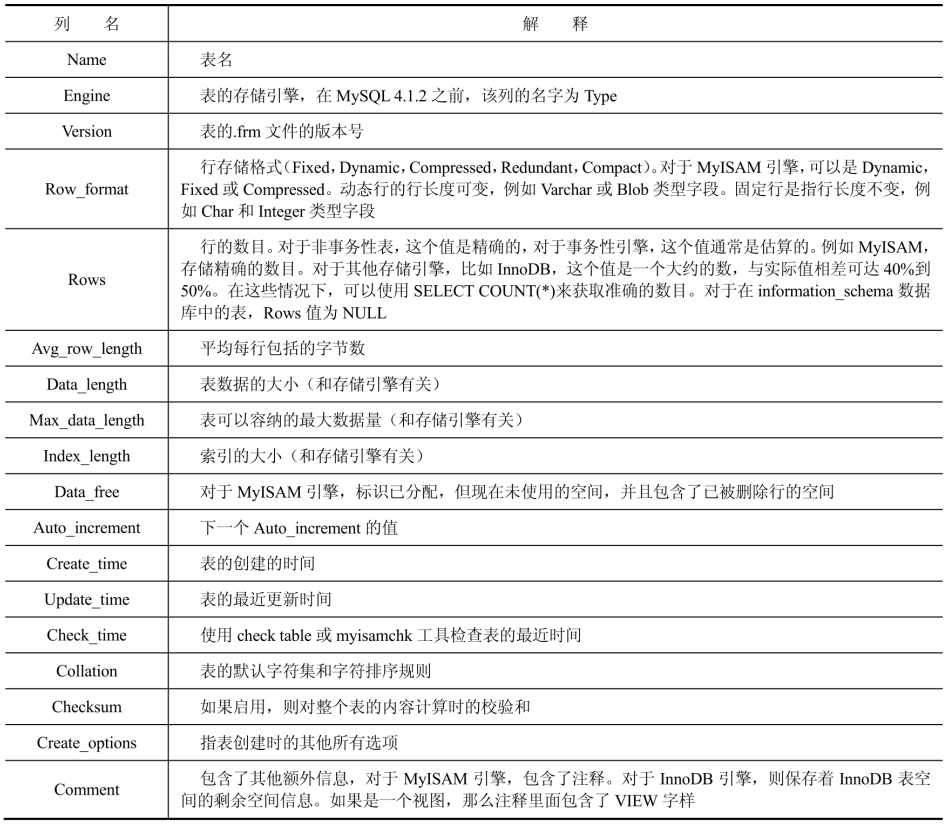
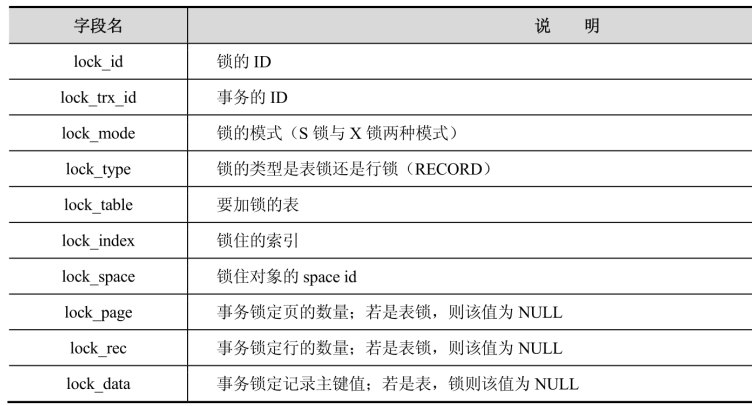

# 维护 MySQL 数据库


## 获取表的详细信息

可以使用 `SHOW TABLE STATUS` 获取表的详细信息。

```sql
show table status from sql_test like 'vote_record';
```

1. `show table status from db_name` 查询db_name数据库里所有表的信息。
2. `show table status from db_name like 'lhrusr'\G;` 查询db_name里lhrusr表的信息。
3. `show table status from db_name like 'uc%'` 查询db_name数据库里表名以uc开头的表的信息。



也可以使用 `information_schema.tables` 表来查询。

## 查看视图（VIEW）的定义

可以通过“SHOW CREATE VIEW VIEW_NAME;”、“SHOW CREATE TABLE VIEW_NAME;”或直接查询INFORMATION_SCHEMA.VIEWS表来获取视图（VIEW）的定义。

## 查询指定数据库中指定表的所有字段名

可以通过查询INFORMATION_SCHEMA.COLUMNS表来获取所有字段名，查询的SQL为：

```sql
select *
from information_schema.columns
where table_schema = 'information_schema'
  and table_name = 'columns';
```

也可以通过“SHOW FULL COLUMNS FROM TB_NAME;”来获取字段名，但是查询INFORMATION_SCHEMA.COLUMNS获取到的信息更加全面。

## 管理 MySQL 多实例

MySQL 多实例是指在一台机器上开启多个不同的服务端口（例如：3306、3307等），运行多个 MySQL 服务进程，通过不同的 Socket 监听不同的服务端口来提供各自的服务。

MySQL 多实例可以有效利用服务器资源，当单个服务器资源有剩余时，可以充分利用剩余的资源提供更多的服务，从而节约了服务器资源。

一般有两种方式来部署 MySQL 多实例：第一种是使用多个配置文件启动不同的进程来实现多实例，这种方式的优势是逻辑简单、配置简单，缺点是管理起来不太方便；第二种是通过官方自带的 mysqld_multi 使用单独的配置文件来实现多实例，这种方式定制每个实例的配置不太方面，优点是管理起来很方便，可以集中管理。

mysqld_multi常用的命令如下所示：

- 启动全部实例：mysqld_multi start。
- 查看全部实例状态：mysqld_multi report。
- 启动单个实例：mysqld_multi start 3306。
- 停止单个实例：mysqld_multi stop 3306。
- 查看单个实例状态：mysqld_multi report 3306。

## 间隙（Next-Key）锁

当使用范围条件而不是相等条件检索数据的时候，并请求共享或排它锁时，InnoDB 会给符合条件的已有数据记录的索引项加锁；对于键值在条件范围内但并不存在的记录，称为“间隙（GAP）”，InnoDB 也会对这个“间隙”加锁，这种锁机制就是所谓的间隙（Next-Key）锁。间隙锁是 InnoDB 中行锁的一种，但是这种锁锁住的不止一行数据，它锁住的是多行，是一个数据范围。间隙锁的主要作用是为了防止出现幻读（Phantom Read），用在 Repeated-Read（简称RR）隔离级别下。在 Read-Commited（简称RC）下，一般没有间隙锁（有外键情况下例外，此处不考虑）。间隙锁还用于恢复和复制。

间隙锁的出现主要集中在同一个事务中先 DELETE 后 INSERT 的情况下，当通过一个条件删除一条记录的时候，如果条件在数据库中已经存在，那么这个时候产生的是普通行锁，即锁住这个记录，然后删除，最后释放锁。如果这条记录不存在，那么问题就来了，数据库会扫描索引，发现这个记录不存在，这个时候的 DELETE 语句获取到的就是一个间隙锁，然后数据库会向左扫描，扫到第一个比给定参数小的值，向右扫描，扫描到第一个比给定参数大的值，然后以此为界，构建一个区间，锁住整个区间内的数据，一个特别容易出现死锁的间隙锁诞生了。

在 MySQL 的 InnoDB 存储引擎中，如果更新操作是针对一个区间的，那么它会锁住这个区间内所有的记录，例如 UPDATE XXX WHERE ID BETWEEN A AND B，那么它会锁住A到B之间所有记录，注意是所有记录，甚至如果这个记录并不存在也会被锁住，在这个时候，如果另外一个连接需要插入一条记录到A与B之间，那么它就必须等到上一个事务结束。典型的例子就是使用 AUTO_INCREMENT ID，由于这个ID是一直往上分配的，因此，当两个事务都 INSERT 时，会得到两个不同的 ID，但是这两条记录还没有被提交，因此，也就不存在，如果这个时候有一个事务进行范围操作，而且恰好要锁住不存在的 ID，就是触发间隙锁问题。所以，MySQL 中尽量不要使用区间更新。InnoDB 除了通过范围条件加锁时使用间隙锁外，如果使用相等条件请求给一个不存在的记录加锁，那么 InnoDB 也会使用间隙锁！

间隙锁也存在副作用，它会把锁定范围扩大，有时候也会带来麻烦。如果要关闭，那么一是将会话隔离级别改到 RC 下，或者开启 innodb_locks_unsafe_for_binlog（默认是OFF）。间隙锁只会出现在辅助索引上，唯一索引和主键索引是没有间隙锁。间隙锁（无论是S还是X）只会阻塞 INSERT 操作。
在 MySQL 数据库参数中，控制间隙锁的参数是 innodb_locks_unsafe_for_binlog，这个参数的默认值是 OFF，也就是启用间隙锁，它是一个布尔值，当值为 TRUE 时，表示 DISABLE 间隙锁。

## 查看锁

### show processlist

“show processlist;” 可以显示哪些线程正在运行。如果当前用户有 SUPER 权限，那么就可以看到所有线程。如果有线程正在 UPDATE 或者 INSERT 某个表，那么进程的 status 为 updating 或者 sending data。“show processlist;” 只列出前100条数据，如果想列出所有结果，那么可以使用“show full processlist;”。

其中，Id 表示连接 id，可以使用 connection_id() 获取；Time 表示当前命令持续的时间，单位为秒；State 表示当前命令的操作状态，下面是一些常见的状态（State）：


### show open tables

这条命令能够查看当前有哪些表是打开的。in_use 列表示有多少线程正在使用某张表，name_locked 表示该表是否被锁，一般发生在使用 DROP 或 RENAME 命令操作这张表时。所以这条命令不能查询到当前某张表是否有死锁，谁拥有表上的这个锁等信息。

```sql
-- 给数据表上锁
lock tables sql_test.vote_record write;

show open tables from sql_test;

show open tables where In_use > 0;

-- 解锁数据表
unlock tables;
```

### show engine innodb status

查询 InnoDB 存储引擎的运行时信息，包括死锁的详细信息。

```sql
show engine innodb status;
```


### 查看服务器的状态

```sql
show status like '%lock%';
```

### 查询 information_schema 用户下的表

通过 information_shcema 下的 innodb_locks、innodb_lock_waits 和 innodb_trx 这三张表可以更新监控当前事务并且分析存在锁的问题。

查看当前状态产生的 InnoDB 锁，仅在有锁等待时有结果输出：

```sql
select *
from information_schema.INNODB_LOCKS;
```

表结构：



查看当前状态产生的 InnoDB 锁等待，仅在有锁等待时有结果输出：

```sql
select *
from information_schema.INNODB_LOCK_WAITS;
```

表结构：


当前 InnoDB 内核中的当前活跃（active）事务：

```sql
select *
from information_schema.INNODB_TRX;
```

表结构：


可以根据这三张表进行联合查询，得到更直观更清晰的结果。

### 在 MySQL 中查询 OS 线程 id（LWP）

从 MySQL 5.7 开始，在 performance_schema.threads 中加了一列 THREAD_OS_ID，可以通过该列匹配到 OS 线程 id（LWP）。

```sql

```

```sql

```

### 

```sql

```

### 

```sql

```

### 

## MySQL 中 SQL Mode 的作用

SQL Mode（模式）定义了 MySQL 应支持的 SQL 语法、数据校验等，这样可以更容易地在不同的环境中使用 MySQL。SQL Mode 常用来解决下面几类问题：

1. 通过设置 SQL Mode，可以完成不同严格程度的数据校验，有效地保障数据准确性。
2. 通过设置 SQL Mode 为 ANSI 模式，来保证大多数 SQL 符合标准的 SQL 语法，这样应用在不同数据库之间进行迁移时，就不需要对业务 SQL 进行较大的修改。
3. 在不同数据库之间进行数据迁移之前，通过设置 SQL Mode 可以使 MySQL 上的数据更方便地迁移到目标数据库中。

SQL Mode 由参数 sql_mode 来设置，可以在配置文件 my.cnf 中设置，也可在客户端中进行设置。此外，这个参数还可分别进行全局的设置或当前会话的设置，也可以在MySQL启动时设置（--sql-mode=”modes”）。

## MySQL 的物理文件

MySQL 数据库的文件包括：

1. 参数文件：my.cnf。
2. 日志文件，包括错误日志、查询日志、慢查询日志、二进制日志。
3. MySQL 表文件：用来存放 MySQL 表结构的文件，一般以 .frm 为后缀。
4. Socket 文件：当用 Unix 域套接字方式进行连接时需要的文件。
5. pid 文件：MySQL 实例的进程 ID 文件。
6. 存储引擎文件：每个存储引擎都有自己的文件夹来保存各种数据，这些存储引擎真正存储了数据和索引等数据。


## 


## 

```sql

```

## 

```sql

```

## 

```sql

```

```sql

```

```sql

```

```sql

```

```sql

```

```sql

```
